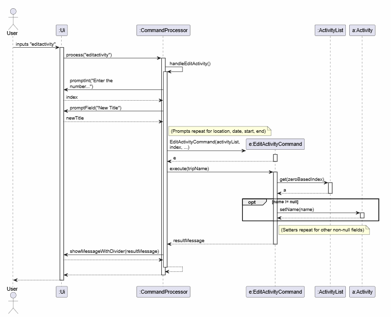
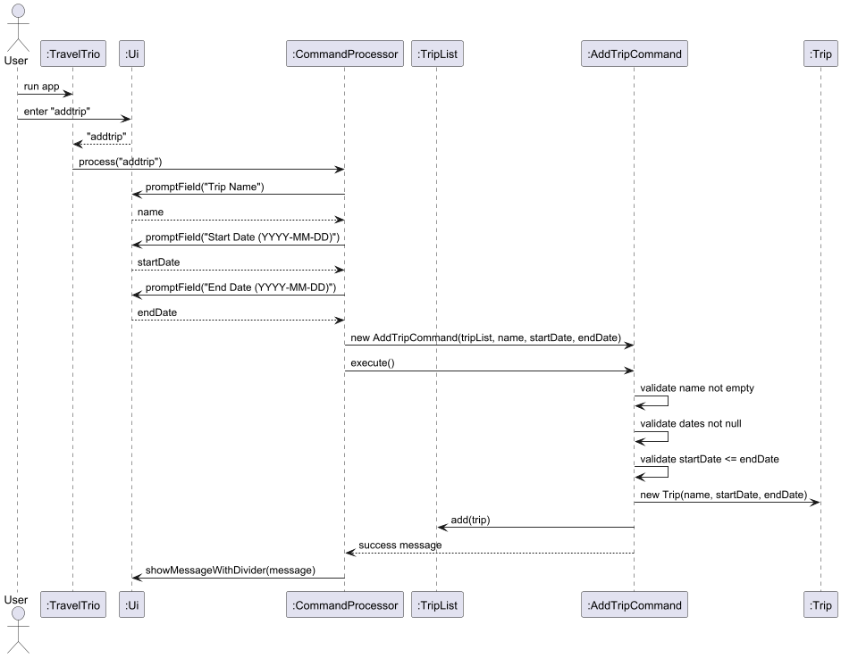

# Developer Guide

## Acknowledgements

{list here sources of all reused/adapted ideas, code, documentation, and third-party libraries -- include links to the original source as well}

## Design & implementation

{Describe the design and implementation of the product. Use UML diagrams and short code snippets where applicable.}

### Add Activity to Itinerary feature
**Implementation** 
The `addactivity` feature is facilitated by `AddActivityCommand`. It allows the user to create a new `Activity` and add it to the `ActivityList` of the currently opened `Trip`.

The feature mainly involves the following classes:
- AddActivityCommand — adds a new Activity into the activity list.
- Activity — represents a single activity with fields such as name, location, date, start time, and end time.
- ActivityList — stores all Activity objects belonging to a trip.
- Trip — owns the corresponding ActivityList.

The `AddActivityCommand` receives the target `ActivityList` of the currently opened `Trip` and the `Activity` to be added. 
When `AddActivityCommand#execute()` is called, the activity is appended to the list and a success message is returned.

Given below is an example usage scenario and how the add activity mechanism behaves at each step.

Step 1. The user opens a trip, for example Japan Trip. The opened Trip contains an `ActivityList`, which may initially be empty.

Step 2. The user executes an `addactivity` command with the relevant activity details, such as activity name, location, date, and time.

Step 3. The application parses the user input and constructs a new Activity object containing the specified details.

Step 4. The application creates an `AddActivityCommand`, passing in the current trip’s ActivityList and the newly created Activity.

Step 5. The user command is executed through `AddActivityCommand#execute()`. The command calls `ActivityList#add(activity)`, causing the new `activity` to be stored in the list.

Step 6. A success message is returned to the user, showing that the activity has been successfully added.

If the command input is invalid, or if no trip is currently opened, the command will not be executed successfully and no activity will be added.

**Sequence Diagram:**

The following sequence diagram shows how an operation to add an activity goes:

### Edit Activity feature 
**Implementation** 
The `editactivity` feature is facilitated by `EditActivityCommand`. It allows the user to modify the details of an existing `Activity` within the `ActivityList` of the currently opened `Trip`.

The feature mainly involves the following classes:
- EditActivityCommand — updates the specified fields of an existing Activity. 
- Activity — represents a single activity whose fields (name, location, date, start time, end time) are being updated. 
- ActivityList — stores all Activity objects belonging to a trip and is used to retrieve the target Activity.
- Trip — owns the corresponding ActivityList.

The `EditActivityCommand` receives the target `ActivityList` of the currently opened `Trip`, the index of the activity to edit and the new details to be updated.
When `EditActivityCommand#execute()` is called, the target activity is retrieved, its specified fields are updated via setter methods, and a success message is returned.

Given below is an example usage scenario and how the edit activity mechanism behaves at each step.

Step 1. The user opens a trip, for example Japan Trip. The opened `Trip` contains an `ActivityList` with existing activities.

Step 2. The user executes an `editactivity` command and is prompted to provide the index of the activity to edit, along with new details such as a new title, location, date, or time.

Step 3. The application collects the user input, capturing the index and any new field values provided (leaving blank inputs as unchanged).

Step 4. The application creates an `EditActivityCommand`, passing in the current trip’s `ActivityList`, the target index, and the newly provided details.

Step 5. The user command is executed through `EditActivityCommand#execute()`. The command retrieves the target `Activity` from the list using the provided index and calls its respective setter methods for any non-empty fields.

Step 6. A success message is returned to the user, showing that the activity has been successfully updated.

If the command input is invalid (such as an out-of-bounds index), or if no trip is currently opened, the command will not be executed successfully and the activity will remain unchanged.

**Sequence Diagram:**

The following sequence diagram shows how an operation to edit an activity goes:

### Add Trip feature
**Implementation** 
The `addtrip` feature is facilitated by `AddTripCommand`. It allows the user to create a new `Trip` and add it to the `TripList`.

The feature mainly involves the following classes:
- AddTripCommand — adds a new Trip into the trip list.
- Trip — represents a single trip with fields such as name, start date, and end date.
- TripList — stores all Trip objects created by the user.

The `AddTripCommand` receives the shared `TripList` and the trip details (name, start date, end date) to be added. 
When `AddTripCommand#execute()` is called, the command validates the inputs, creates a new `Trip`, adds it to the list, and returns a success message.

Given below is an example usage scenario and how the add trip mechanism behaves at each step.

Step 1. The user starts the application. The application loads an existing `TripList`, which may initially be empty.

Step 2. The user executes an `addtrip` command with the relevant trip details, such as trip name, start date, and end date.

Step 3. The application collects the user input through the `Ui` and passes it to the `CommandProcessor`.

Step 4. The application creates an `AddTripCommand`, passing in the current `TripList` and the provided trip details.

Step 5. The user command is executed through `AddTripCommand#execute()`. The command validates that the name is not empty, the dates are provided, and that the start date is not later than the end date. A new `Trip` object is then created.

Step 6. The command calls `TripList#add(trip)`, causing the new `trip` to be stored in the list.

Step 7. A success message is returned to the user, showing that the trip has been successfully added.

If the command input is invalid, the command will not be executed successfully and no trip will be added.

**Sequence Diagram:**

The following sequence diagram shows how an operation to add a trip goes:

## Product scope
### Target user profile

{Describe the target user profile}

### Value proposition

{Describe the value proposition: what problem does it solve?}

## User Stories

|Version| As a ...              | I want to ...                                                                 | So that I can ...                                                    |
|--------|-----------------------|-------------------------------------------------------------------------------|----------------------------------------------------------------------|
|v1.0| new user              | see usage instructions                                                        | refer to them when I forget how to use the application               |
|v1.0| Organized user        | view all acitivities that I had added to the activity list at once            | see all of the activities i had planned for my trip                  |
|v1.0| Organized user        | add activities to a trip with details (e.g., activity name, time and location | append new activity to my list of activities in the itinerary        |
|v2.0| Thrifty User          | record my actual spending for planned activities                              | easily track and compare my actual expenses against my planned budget |

## Non-Functional Requirements

{Give non-functional requirements}

## Glossary

* *glossary item* - Definition

## Instructions for manual testing

{Give instructions on how to do a manual product testing e.g., how to load sample data to be used for testing}
