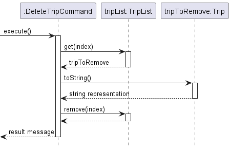
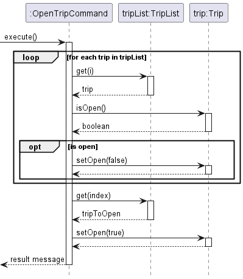
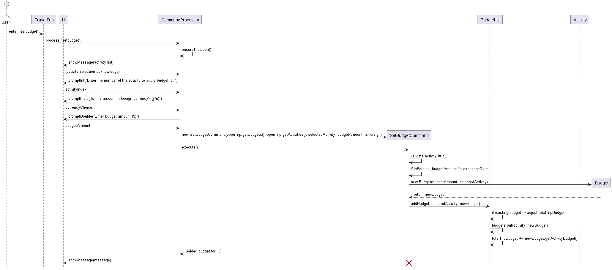
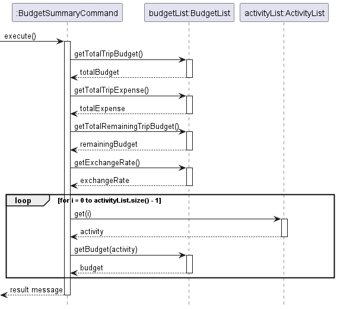
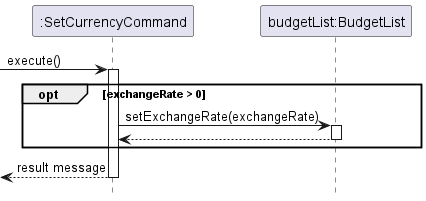
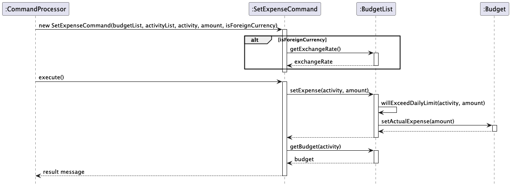
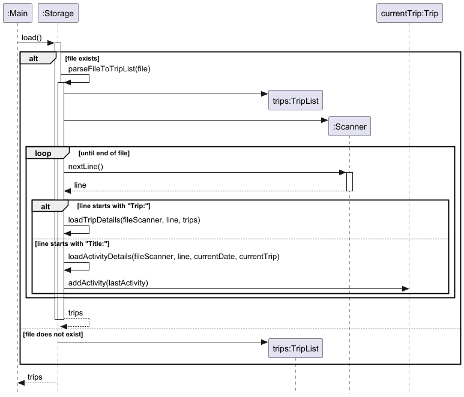

# Developer Guide

## Acknowledgements

- The command-step-prompting logic was inspired by the [AB3](https://seedu.org/addressbook-level3/) project architecture.
- UML diagrams generated with [PlantUML](https://plantuml.com/).
- AI was used for trivial debugging.

## Design
TravelTrio follows a multi-layered architecture, separating concerns into four main components. This design follows the Separation of Concerns (SoC) principle, ensuring that changes in the user interface do not affect the core data logic or storage mechanisms.
**Architecture Diagram**:

- `UI`: Handles all user interactions, input parsing (initial stage), and printing formatted feedback.
- `Logic`: Contains the `Command` classes. It processes the user's intent, validates constraints, and manipulates the Model. 
- `Model`: Holds the data structures (Trips, Activities, etc.) and enforces business rules (e.g., conflict detection for overlapping activities). 
- `Storage`: Manages file I/O operations, ensuring data persists in the hierarchical `.txt` format. It is responsible for translating the in-memory `Model` into a storable format.

### Architecture 

### Model 
- The core logic of TravelTrio is built around a hierarchical model where Trip serves as the aggregate root. This ensures that itinerary, financial, and checklist data are strictly encapsulated.
- **Class diagram:**


Key Structural Components:
- `Trip`: The central entity. It owns an `ActivityList` (itinerary), `BudgetList` (financials), and `PackingList` (checklist).
- `Storage`: Uses a dependency-based relationship to reconstruct the model hierarchy from local text files.
- `BudgetList`: Uses a `Map<Activity, Budget>` to maintain a 1-to-1 association between scheduled events and their allocated funds.

Object Diagram
- The following diagram illustrates an example of the system state when a user is managing trips. It demonstrates how instances of `Activity`, `Budget`, and `PackingItem` are linked together under a specific Trip instance.

- Scenario Details:
  - Trip Management: The user has one trip in their TripList. The "Japan Trip 2024" is currently open.
  - Itinerary Planning: The open trip contains three activities: "Mount Fuji Day Trip", "Tokyo Tower Visit", and "Sushi Making Class".
  - Financial Tracking:
    - A budget of $300.00 is specifically linked to the Mount Fuji Day Trip activity.
    - A budget of $100.00 is linked to the Tokyo Tower Visit activity.
    - Actual expense is also tracked for both activities, with $280.00 for the Mount Fuji Day Trip activity and $85.00 for the Tokyo Tower Visit activity.
    - No budget is set for the Sushi Making Class activity.
  - Packing Progress: The packing list for the current trip includes:
    - "Camera" (already packed)
    - "Winter Jacket" (not yet packed)
    - "Travel Adapter" (not yet packed)
    - "Passport" (already packed)

### Command Hierarchy
Taking trip commands as an example, in the diagram below, we see that all trip-related actions inherit from an abstract TripCommand class.

Key Design Features:
- Inheritance: Each specific action (e.g., `AddTripCommand`, `OpenTripCommand`) extends the base `TripCommand`. They all implement the `execute()` method, allowing the application to run any trip command without knowing its specific type at runtime.

External Dependencies:
- TripList: Most commands interact with the `TripList` to add or remove trip data.
- Storage: The `ExportTripCommand` and `ImportTripCommand` specifically maintain an association with the `Storage` component. This allows them to handle the complex task of reading from or writing to external `.txt` files independently of the main application loop.

This hierarchy is also observed in the other command classes (e.g., `ActivityCommand`, `BudgetCommand`)

## Implementation

### Add Activity to Itinerary feature
**Implementation**<br>
The `addactivity` feature is implemented across `CommandProcessor`, `AddActivityCommand`, `ActivityCommand` (base class), and `ActivityList`. Its purpose is to collect activity details from the user, validate them, and insert a new `Activity` into the `ActivityList` of the currently opened `Trip` in chronological order.

The feature involves the following classes:
- `CommandProcessor` — orchestrates user input collection and pre-validates the date and time fields before constructing the command.
- `ActivityCommand` — abstract base class that implements `run(tripName)`, which guards execution behind a trip-open check before delegating to `execute(tripName)`.
- `AddActivityCommand` — performs a second date-range validation, constructs the `Activity`, and calls `ActivityList#add()`.
- `Activity` — the data object representing a scheduled event, with fields for name, location, date, start time, and end time.
- `ActivityList` — enforces conflict detection and maintains activities in sorted order by date and start time.
- `Trip` — the aggregate root that owns the `ActivityList`.

**Input collection and pre-validation in `CommandProcessor`**

When the user enters `addactivity`, `CommandProcessor#handleAddActivity()` is called. It first calls `ensureTripOpen()` to confirm a trip is active, then collects the following fields one by one via `Ui`:

1. **Title** — prompted with `promptField("Activity Title")`.
2. **Location** — prompted with `promptField("Location")`.
3. **Date** — prompted in a loop using `promptDate("Date")`. If the entered date falls outside the trip’s start/end dates, an error is shown and the user is re-prompted until a valid date is entered.
4. **Start Time** — prompted with `promptTime("Start Time")`.
5. **End Time** — prompted with `promptTime("End Time")`. If the end time is not strictly after the start time, the user is asked whether the activity crosses midnight. If they confirm (`y`), the times are accepted as-is; otherwise a `TravelTrioException` is thrown and the command is aborted.

After all fields are collected, an `AddActivityCommand` is constructed with `openTrip.getActivities()` and the five string fields. `CommandProcessor` then calls `.run(openTrip.getName())` on it.

**Execution in `ActivityCommand#run()` and `AddActivityCommand#execute()`**

`run(tripName)` (defined in `ActivityCommand`) first calls `activityList.isTripOpen()` to re-confirm the trip is still open, then delegates to `execute(tripName)`.

`AddActivityCommand#execute(tripName)`:
1. Calls `validateActivityDateWithinTripRange(date, activityList)` — retrieves the associated `Trip` from the `ActivityList` and checks that the activity date falls within the trip’s date range. If not, a `TravelTrioException` is thrown.
2. Constructs a new `Activity(name, location, date, startTime, endTime)`.
3. Calls `activityList.add(newActivity)`.

**Conflict detection and sorted insertion in `ActivityList#add()`**

`ActivityList#add(activity)` performs two steps:
1. **Overlap check** — iterates all existing activities and calls `activity.overlapsWith(existing)` on each. If any overlap is found, a `TravelTrioException` is thrown with the conflicting activity’s details. No activity is added.
2. **Sorted insertion** — if no conflict is found, the method finds the correct insertion index by comparing dates and start times (`isEarlier()`), then calls `activities.add(insertIdx, activity)`. This keeps the list in chronological order at all times.

On success, `add()` returns `null`, and `execute()` returns the success message `"Activity added to [tripName]:\n\n" + activity`. `CommandProcessor` passes this to `ui.showMessageWithDivider()`.

**Given below is an example usage scenario and how the add activity mechanism behaves at each step.**

Step 1. The user has already opened a trip (e.g., "Japan Trip", 2026-03-15 to 2026-03-22). The trip’s `ActivityList` may already contain some activities.

Step 2. The user types `addactivity`. `CommandProcessor` calls `ensureTripOpen()` to verify a trip is active, then prompts the user for Title and Location.

Step 3. `CommandProcessor` prompts for the Date in a loop. If the entered date falls outside the trip’s range, an error is shown and the user is re-prompted until a valid date is entered.

Step 4. `CommandProcessor` prompts for Start Time and End Time. If the end time is not strictly after the start time, the user is asked whether the activity crosses midnight. If they do not confirm, a `TravelTrioException` is thrown and the command is aborted.

Step 5. `CommandProcessor` constructs `new AddActivityCommand(activityList, title, location, date, startTime, endTime)` and calls `.run("Japan Trip")`. `ActivityCommand#run()` re-confirms the trip is open, then calls `execute("Japan Trip")`.

Step 6. `execute()` calls `validateActivityDateWithinTripRange()` as a defensive check, then constructs a new `Activity` and calls `activityList.add(newActivity)`.

Step 7. `ActivityList#add()` checks the new activity against all existing activities for time overlaps. If a conflict is found, a `TravelTrioException` is thrown. Otherwise, the activity is inserted at the correct chronological position.

Step 8. A success message is returned to `CommandProcessor` and displayed to the user via `ui.showMessageWithDivider()`.

If a trip is not open, if the date is outside the trip’s range, or if the activity overlaps with an existing one, a `TravelTrioException` is thrown, the error is shown via `ui.showError()`, and no activity is added.

**Design Considerations**

- **Two-layer date validation**: The date range check occurs in both `CommandProcessor` (as a loop that re-prompts the user) and in `AddActivityCommand#execute()` (which throws an exception). The first layer provides a better user experience by letting the user correct their input without restarting the command. The second layer acts as a defensive guard in case the command is constructed programmatically (e.g., in tests) without going through `CommandProcessor`.
- **Sorted insertion over post-sort**: Activities are inserted in sorted order immediately on `add()` rather than sorting the list on every display. This keeps the list consistently ordered and ensures that overlap detection always works against a predictable structure.
- **`run()` / `execute()` separation**: The `run()` method in `ActivityCommand` centralises the trip-open guard for all activity commands. Each concrete command only implements `execute()` for its own logic, avoiding duplicated guard code across subclasses.

**Sequence Diagram:**

The following sequence diagram shows the success path of the `addactivity` operation, assuming all user inputs are valid:


### Edit Activity feature 
**Implementation**<br>
The `editactivity` feature is facilitated by `EditActivityCommand`. It allows the user to modify the details of an existing `Activity` within the `ActivityList` of the currently opened `Trip`.

The feature mainly involves the following classes:
- EditActivityCommand — updates the specified fields of an existing Activity. 
- Activity — represents a single activity whose fields (name, location, date, start time, end time) are being updated. 
- ActivityList — stores all Activity objects belonging to a trip and is used to retrieve the target Activity.
- Trip — owns the corresponding ActivityList.

The `EditActivityCommand` receives the target `ActivityList` of the currently opened `Trip`, the index of the activity to edit and the new details to be updated.
When `EditActivityCommand#execute()` is called, the target activity is retrieved, its specified fields are updated via setter methods, and a success message is returned.

Given below is an example usage scenario and how the edit activity mechanism behaves at each step.

Step 1. The user opens a trip, for example Japan Trip. The opened `Trip` contains an `ActivityList` with existing activities.

Step 2. The user executes an `editactivity` command and is prompted to provide the index of the activity to edit, along with new details such as a new title, location, date, or time.

Step 3. The application collects the user input, capturing the index and any new field values provided (leaving blank inputs as unchanged).

Step 4. The application creates an `EditActivityCommand`, passing in the current trip’s `ActivityList`, the target index, and the newly provided details.

Step 5. The user command is executed through `EditActivityCommand#execute()`. The command retrieves the target `Activity` from the list using the provided index and calls its respective setter methods for any non-empty fields.

Step 6. A success message is returned to the user, showing that the activity has been successfully updated.

If the command input is invalid (such as an out-of-bounds index), or if no trip is currently opened, the command will not be executed successfully and the activity will remain unchanged.

**Sequence Diagram:**

The following sequence diagram shows how an operation to edit an activity goes:


### Add Remark Activity feature
**Implementation**<br>
The `addremark` feature is facilitated by `AddRemarkCommand`. It allows the user to add custom remarks or notes to an existing `Activity` within the `ActivityList` of the currently opened `Trip`.

The feature mainly involves the following classes:
- `AddRemarkCommand` — adds a remark to the specified activity.
- `Activity` — represents a single activity whose remark field is being updated.
- `ActivityList` — stores all `Activity` objects belonging to a trip and is used to retrieve the target activity.
- `Trip` — owns the corresponding `ActivityList`.

The `AddRemarkCommand` receives the target `ActivityList`, the index of the activity to add a remark to, and the remark text.
When `AddRemarkCommand#execute()` is called, the target activity is retrieved, its remark field is updated via the setter method, and a success message is returned.

Given below is an example usage scenario and how the add remark mechanism behaves at each step.

Step 1. The user opens a trip, for example Japan Trip. The opened `Trip` contains an `ActivityList` with existing activities.

Step 2. The user executes an `addremark` command and is shown the list of activities with their current remarks (or `-` if no remark exists).

Step 3. The application collects the user input, capturing the index of the activity and the remark text.

Step 4. The application creates an `AddRemarkCommand`, passing in the current trip's `ActivityList`, the target index, and the remark text.

Step 5. The user command is executed through `AddRemarkCommand#execute()`. The command retrieves the target `Activity` from the list using the provided index and calls its `setRemark()` method.

Step 6. A success message is returned to the user, showing that the remark has been successfully added to the activity.

If the command input is invalid (such as an out-of-bounds index), or if no trip is currently opened, the command will not be executed successfully and the activity will remain unchanged.

**Sequence Diagram:**

The following sequence diagram shows how an operation to add a remark to an activity goes:


### Add Trip feature
**Implementation**<br>
The `addtrip` feature is facilitated by `AddTripCommand`. It allows the user to create a new `Trip` and add it to the `TripList`.

The feature mainly involves the following classes:
- AddTripCommand — adds a new Trip to the trip list.
- Trip — represents a single trip with fields such as name, start date, and end date.
- TripList — stores all Trip objects created by the user.

The `AddTripCommand` receives the shared `TripList` and the trip details (name, start date, end date) to be added. 
When `AddTripCommand#execute()` is called, the command validates the inputs, creates a new `Trip`, adds it to the list, and returns a success message.

Given below is an example usage scenario and how the add trip mechanism behaves at each step.

Step 1. The user starts the application. The application loads an existing `TripList`, which may initially be empty.

Step 2. The user executes an `addtrip` command with the relevant trip details, such as trip name, start date, and end date.

Step 3. The application collects the user input through the `Ui` and passes it to the `CommandProcessor`.

Step 4. The application creates an `AddTripCommand`, passing in the current `TripList` and the provided trip details.

Step 5. The user command is executed through `AddTripCommand#execute()`. The command validates that the name is not empty, the dates are provided, and that the start date is not later than the end date. A new `Trip` object is then created.

Step 6. The command calls `TripList#add(trip)`, causing the new `trip` to be stored in the list.

Step 7. A success message is returned to the user, showing that the trip has been successfully added.

If the command input is invalid, the command will not be executed successfully and no trip will be added.

**Sequence Diagram:**

The following sequence diagram shows how an operation to add a trip goes:


### Delete Trip feature 
**Implementation**<br>
The `deletetrip` feature is facilitated by `DeleteTripCommand`. It allows the user to delete a trip from the trip list by its index.

The feature mainly involves the following classes:
- `DeleteTripCommand` — removes the specified trip from the trip list.
- `TripList` — stores all `Trip` objects and is used to retrieve and remove the target trip.

The `DeleteTripCommand` receives the target `TripList` and the 1-based index of the trip to delete. When `DeleteTripCommand#execute()` is called, it validates that the index is within the bounds of the current trip list before attempting removal. It removes the trip and returns a confirmation message.

Given below is an example usage scenario and how the delete trip mechanism behaves at each step.

Step 1. The user executes a `deletetrip` command and provides the 1-based index of the trip they wish to delete.

Step 2. The application collects the user input, capturing the index.

Step 3. The application creates a `DeleteTripCommand`, passing in the current `TripList` and the target index.

Step 4. The user command is executed through `DeleteTripCommand#execute()`. The command validates that the index is valid (greater than or equal to 0, and less than the trip list size). 

Step 5. The command captures the string representation of the trip to be removed and calls `tripList.remove(index)`.

Step 6. A formatted string confirming the successful deletion of the trip is returned to the user.

If the command input is invalid (such as an out-of-bounds index), a `TravelTrioException` is thrown and the command will not be executed successfully.

**Sequence Diagram:**

The following sequence diagram shows how an operation to delete a trip goes:


### Open Trip feature
**Implementation**<br>
The `opentrip` feature is facilitated by `OpenTripCommand`. It allows the user to open a specific trip for editing. Crucially, it ensures only one trip is open at a time by closing any previously open trip.

The feature mainly involves the following classes:
- `OpenTripCommand` — opens the target trip and closes all others.
- `TripList` — stores all `Trip` objects, which are iterated over to manage open states.
- `Trip` — represents the travel plan whose open status is being modified.

The `OpenTripCommand` receives the target `TripList` and the 1-based index of the trip to open. When `OpenTripCommand#execute()` is called, it iterates through the entire list to set any open trip's status to false, then sets the target trip's status to active.

Given below is an example usage scenario and how the open trip mechanism behaves at each step.

Step 1. The user executes an `opentrip` command, providing the index of the trip they wish to access.

Step 2. The application creates an `OpenTripCommand`, passing in the `TripList` and the target index.

Step 3. The user command is executed through `OpenTripCommand#execute()`. The command validates that the index is within bounds.

Step 4. The command iterates through the `TripList`, checking if any `Trip` is currently open. If one is found, it calls `trip.setOpen(false)`.

Step 5. The command retrieves the target trip and calls `tripToOpen.setOpen(true)`.

Step 6. A formatted string confirming the successful opening of the target trip is returned.

If the provided trip index is out of bounds, a `TravelTrioException` is thrown and the currently open trip (if any) remains open.

**Sequence Diagram:**

The following sequence diagram shows how an operation to open a trip goes:


### Set Budget feature
**Implementation**<br>

The `setbudget` feature is facilitated by `SetBudgetCommand`. It allows the user to add a budget for an existing `Activity` within the `ActivityList` of the currently opened `Trip`.

The feature mainly involves the following classes:
- SetBudgetCommand — adds a new Budget for the specified Activity.
- Budget — represents the budget object for an activity.
- BudgetList — stores all Budget objects for activities in a trip.
- Activity — represents a single activity for which the budget is set.
- ActivityList — stores all Activity objects belonging to a trip.
- Trip — owns the corresponding ActivityList and BudgetList.
- CommandProcessor — handles the user input, ensures a trip is open, and orchestrates the creation of the command.
- Ui — handles all interactions with the user, such as prompting for the activity index and budget amount.
- Storage — handles all saving and loading of text files, allowing for data persistence across sessions. 

The `SetBudgetCommand` receives the target `BudgetList`, `ActivityList`, the specific `Activity`, the budget amount, and whether the amount is in foreign currency.
When `SetBudgetCommand#execute()` is called, a new `Budget` is created and added to the `BudgetList` for the activity, and a success message is returned.

Given below is an example usage scenario and how the set budget mechanism behaves at each step.

Step 1. The user opens a trip, for example Japan Trip. The opened Trip contains an `ActivityList` with existing activities and a `BudgetList` which may be empty.

Step 2. The user executes a `setbudget` command, followed by seeing the list of all current activities.

Step 3. The application prompts the user to select an activity from the list, choose the currency, and enter the budget amount.

Step 4. The application creates a `SetBudgetCommand`, passing in the current trip’s `BudgetList`, `ActivityList`, the selected `Activity`, the budget amount, and the currency flag.

Step 5. The user command is executed through `SetBudgetCommand#execute()`. The command creates a new `Budget` object and calls `BudgetList#addBudget(activity, budget)` to store it.

Step 6. A success message is returned to the user, showing that the budget has been successfully added.

If the command input is invalid, or if no trip is currently opened, the command will not be executed successfully and no budget will be added.

**Sequence Diagram:**

The following sequence diagram shows how an operation to set budget goes:



### Budget Summary feature
**Implementation**<br>
The `budgetsummary` feature is facilitated by `BudgetSummaryCommand`. It generates a comprehensive summary of the trip's financial status, calculating overall totals and providing an itemized breakdown per activity.

The feature mainly involves the following classes:
- `BudgetSummaryCommand` — compiles the budget summary string.
- `BudgetList` — calculates the total trip budget, total trip expense, and remaining trip budget.
- `ActivityList` — provides the scheduled activities to match against assigned budgets.

The `BudgetSummaryCommand` receives the `BudgetList` and `ActivityList`. When `BudgetSummaryCommand#execute()` is called, it builds a formatted string with overall financial totals, followed by a line-by-line breakdown of each activity that has an allocated budget.

Given below is an example usage scenario and how the budget summary mechanism behaves at each step.

Step 1. The user opens a trip containing an `ActivityList` and `BudgetList`.

Step 2. The user executes a `budgetsummary` command.

Step 3. The application creates a `BudgetSummaryCommand`, passing in the trip's `BudgetList` and `ActivityList`.

Step 4. The user command is executed through `BudgetSummaryCommand#execute()`. The command fetches the total budget, total expense, and remaining budget from `BudgetList` and formats them into a summary block.

Step 5. The command checks if the budget list is empty. If it contains budgets, it iterates through the `ActivityList`.

Step 6. For each activity, it checks if a corresponding budget exists. If found, it appends the activity index and budget details to the itemized breakdown.

Step 7. The final formatted string is displayed to the user.

If no budgets have been added to the trip yet, a `TravelTrioException` is thrown to notify the user.

**Sequence Diagram:**

The following sequence diagram shows how an operation to view the budget summary goes:


### Set Currency feature
**Implementation**<br>
The `setcurrency` feature is facilitated by `SetCurrencyCommand`. It allows the user to update the multiplier used to convert foreign currency expenses into the user's home currency for the entire trip.

The feature mainly involves the following classes:
- `SetCurrencyCommand` — updates the exchange rate.
- `BudgetList` — holds the financial data for the trip and stores the current exchange rate.

The `SetCurrencyCommand` receives the target `BudgetList`, `ActivityList`, a null/dummy activity, and the exchange rate. When `SetCurrencyCommand#execute()` is called, it applies the new conversion rate to the `BudgetList`. 

Given below is an example usage scenario and how the set currency mechanism behaves at each step.

Step 1. The user opens a trip containing a `BudgetList`.

Step 2. The user executes a `setcurrency` command and provides the new exchange rate.

Step 3. The application creates a `SetCurrencyCommand`, passing in the current trip's `BudgetList`, `ActivityList`, and the exchange rate.

Step 4. The user command is executed through `SetCurrencyCommand#execute()`. The command validates that the provided exchange rate is strictly greater than zero.

Step 5. The command calls `budgetList.setExchangeRate(exchangeRate)`.

Step 6. A formatted string confirming the new exchange rate (e.g., "1 Foreign Currency = X.XXXX Home Currency") is returned.

If the provided exchange rate is less than or equal to zero, a `TravelTrioException` is thrown.

**Sequence Diagram:**

The following sequence diagram shows how an operation to set the currency exchange rate goes:


### Set Expense feature
**Implementation**<br>
The `setexpense` feature is implemented by `SetExpenseCommand`. Its purpose is to record the actual money spent for a specific activity, applying foreign currency conversion if needed, enforcing an optional daily spending limit, and warning the user when spending approaches the activity's budget cap.

The feature mainly involves the following classes:
- `CommandProcessor` — verifies that a trip is open and that both activities and budgets exist, collects the activity index, currency choice, and amount from the user, then constructs and invokes `SetExpenseCommand`.
- `SetExpenseCommand` — extends `ExpenseCommand`. Converts the amount to home currency in the constructor if the user indicated a foreign currency, then delegates to `BudgetList` during execution.
- `BudgetList` — applies the two core constraints (budget must exist; daily limit must not be exceeded) and updates `totalTripExpense` after the change.
- `Budget` — validates that the amount is non-negative and within the allocated budget cap, then stores the final value.

**Currency conversion**

Foreign-to-home currency conversion takes place inside the `SetExpenseCommand` constructor, before `execute()` is called:

```java
if (isForeignCurrency) {
    this.amount = amount * budgetList.getExchangeRate();
}
```

All downstream classes therefore work exclusively with home-currency amounts and need no knowledge of the original currency.

**Validation chain in `BudgetList.setExpense()`**

`BudgetList.setExpense()` applies two checks in sequence before modifying any data:
1. **Budget existence** — throws `TravelTrioException` if the target activity has no assigned budget.
2. **Daily limit** — calls `willExceedDailyLimit(activity, newExpense)`, which computes the projected day total as `currentDayTotal - oldExpense + newExpense`. Subtracting the old expense ensures that updating an existing record is handled correctly without requiring the caller to pass the old value explicitly.

Only after both checks pass does it call `budget.setActualExpense(newExpense)` and update `totalTripExpense`.

**Near-budget warning**

After `setExpense()` returns, `execute()` retrieves the activity's budget cap and computes the percentage consumed. If this reaches 90% or more, a warning is appended to the result message. The same threshold check exists independently in `Budget.toString()`.

**Given below is an example usage scenario and how the set expense mechanism behaves at each step.**

Step 1. The user opens a trip containing at least one activity with an assigned budget, then types `setexpense`. `CommandProcessor` displays the activity list and prompts for an index. The user can type `exit` to abort.

Step 2. `CommandProcessor` prompts for the currency type and amount, then constructs a `SetExpenseCommand`. If foreign currency was chosen, the amount is converted to home currency immediately in the constructor.

Step 3. `execute()` calls `budgetList.setExpense(activity, amount)`. `BudgetList` verifies the budget exists and the daily limit will not be breached, then calls `budget.setActualExpense(amount)` and updates `totalTripExpense`.

Step 4. `execute()` retrieves the budget cap, computes the percentage spent, and returns a success message (with an optional 90% warning) to `CommandProcessor`.

**Sequence Diagram:**

The following sequence diagram shows the success path of the `setexpense` operation, from command construction through to the expense being stored:



**Design Considerations**

- **Currency conversion at construction, not execution**: Keeping the conversion in the constructor makes `execute()` and all downstream classes currency-agnostic. The trade-off is that the original foreign amount is discarded after construction and cannot be recovered.
- **Duplicate 90% threshold**: The near-budget warning is computed independently in both `SetExpenseCommand.execute()` and `Budget.toString()`. Centralizing the threshold into `Budget` — for example as an `isNearLimit()` method — would make a future threshold change a single-point edit.
- **Hard rejection when expense exceeds budget**: `Budget.setActualExpense()` throws if the amount exceeds the allocated cap. Changing this to a soft warning instead of a hard rejection would make the feature more flexible for real-world over-spending scenarios.

---

### List Expense feature
**Implementation**<br>
The `listexpense` feature is implemented by `ListExpenseCommand`. It displays all activities in a chronological table, showing the actual expense for budgeted activities and a dash for unbudgeted ones, with a total at the bottom. If a daily spending limit is set, it is shown in the header.

The feature mainly involves the following classes:
- `CommandProcessor` — verifies that a trip is open and that activities and budgets are non-empty, then constructs `ListExpenseCommand(openTrip)` and calls `execute()`.
- `ListExpenseCommand` — extends `ExpenseCommand`. Iterates `ActivityList` directly and formats the expense data into a table string.
- `Trip` — passed at construction to extract the trip name; `BudgetList` and `ActivityList` are delegated to the `ExpenseCommand` base class.
- `BudgetList` — queried per activity via `getBudget(activity)` to retrieve actual expense values and the daily limit.

**Display pipeline**

`execute()` builds the output in three stages:

1. **Header** — prints the trip name and the daily spending limit if one has been set, accessed via `tripName` and the inherited `budgetList` field.
2. **Row formatting** — iterates `ActivityList` directly in its existing chronological order. For each activity, if a `Budget` exists its actual expense is shown; otherwise a dash (`-`) is displayed in the expense column. The date column is left blank for consecutive rows on the same date to reduce visual noise.
3. **Footer** — prints the accumulated total of all budgeted expenses.

**Design Considerations**

- **Dependency on `Trip` at construction**: The constructor accepts a `Trip` object to extract the trip name, delegating `BudgetList` and `ActivityList` to the `ExpenseCommand` base class. Only `tripName` is stored as a field, keeping the coupling to `Trip` minimal.

### Storage Component
**Implementation**<br>
The `Storage` component handles the data persistence of the application. It is responsible for saving the TripList to a 
local text file and reconstructing those objects when the application restarts.

The feature mainly involves the following classes:
- `Storage` — The main logic class that manages file I/O operations and hierarchical parsing.
- `TripList` — The top-level container that is populated during the loading process.
- `Trip` / `Activity` / `Budget` — Model classes that provide `toFileFormat()` methods to convert objects into storable strings.
- `Scanner` — Used to parse the text file line-by-line within a try-with-resources block.

The `Storage#load()` method implements a **State-Aware Parser**. Because the text file is hierarchical (Activities belong to Dates, which belong to Trips), 
the component maintains internal context variables (`currentTrip`, `currentDate`, `lastActivity`) during execution to ensure child objects are linked to the correct parent objects.

Given below is an example usage scenario and how the storage mechanism behaves during the loading phase.

Step 1. The user starts the application. The `Main` class initializes `Storage` with a file path (e.g., `data/traveltrio.txt`) and calls `load()`.

Step 2. `Storage#load()` checks if the file exists. If not, it returns an empty `TripList`. If it exists, it calls the private `parseFileToTripList(file)` method.

Step 3. Inside the parser, a `Scanner` is opened. As it reads the file line-by-line, it detects a **`Trip:`** header and calls `loadTripDetails(...)`. This creates a new `Trip` object and immediately checks the next line for **`Exchange Rate:`** metadata to set the trip's financial context.

Step 4. When a line starting with **`=== Date:`** is found, the `currentDate` string is updated. This acts as a header for all activities that follow.

Step 5. When a **`Title:`** line is found, the parser calls `loadActivityDetails(...)`. This helper method "consumes" the next three lines (Location, Start Time, and End Time) to construct an `Activity` object, which is then added to the `currentTrip`.

Step 6. If a **`Budget set:`** line is found, the parser calls `loadBudgetDetails(...)`. It reads the total budget and actual expenses and links them to the `lastActivity` using an **assertion** to ensure no budget data is orphaned.

Step 7. Once the end of the file is reached, the fully populated `TripList` is returned to the `Main` controller.

If the parser encounters a line it does not recognize (and is not a known summary line like `Total Budget:`), a `TravelTrioException` is thrown, alerting the user to the specific line that requires manual correction.

**Sequence Diagram:**

The following sequence diagram shows how the `Storage` component interacts with the `Scanner` and `Model` classes to load data:



## Product scope
### Target user profile

TravelTrio is built for users who prefer a fast, keyboard-driven interface over a traditional GUI.
Our core users include:
- The Organized User — Someone who needs to see all their travel plans in one centralized list and wants to append new activities quickly without navigating complex menus.
- The Thrifty User — A traveler who is conscious of their budget and wants to track actual spending against planned estimates in real-time.
- The Tech-Savvy Planner — A user (likely a student or developer) who is comfortable with a Command Line Interface (CLI) and values a lightweight, offline-first application.
- The Frequent Traveler — Someone managing multiple trips who needs a reliable way to switch between different itineraries and export/import data for backup.

### Value proposition

TravelTrio provides a high-speed, distraction-free environment for itinerary management. It is intuitive and bridges the gap between a messy notes app and a complex spreadsheet by offering the following benefits:
- Specific commands to handle trips, activities, and budgets separately but cohesively.
- Instant calculation of remaining budgets and expenses, specifically catering to the "Thrifty User."
- Easy sharing of trips through the export/import feature, allowing "Organized Users" to share plans with friends.

## User Stories

| Version | As a ...                  | I want to ...                                           | So that I can ...                                              |
|---------|---------------------------|---------------------------------------------------------|----------------------------------------------------------------|
| v1.0    | New user                  | see usage instructions                                  | refer to them when I forget how to use the application         |
| v1.0    | Frequent traveler         | create a new trip with a name and date range            | keep my different trips organized separately                   |
| v1.0    | Planner                   | open a specific trip to manage its details              | focus on planning one trip at a time                           |
| v1.0    | Organized user            | view a list of all my planned trips                     | see an overview of all my upcoming travels                     |
| v1.0    | Planner                   | edit an existing activity's details                     | correct mistakes or update plans as they change                |
| v1.0    | Planner                   | delete a trip that I no longer need                     | remove outdated or cancelled trips from my list                |
| v1.0    | Planner                   | add an activity with name, date, time, and location     | build a detailed itinerary for each day of my trip             |
| v1.0    | Planner                   | delete an activity from my itinerary                    | remove cancelled or rescheduled events                         |
| v1.0    | Organized user            | view my itinerary in chronological order                | see the flow of my planned activities                          |
| v2.0    | Traveler                  | export my trip details to a text file                   | share my itinerary with friends or family                      |
| v2.0    | Traveler                  | import a shared trip from a text file                   | use itineraries created by others as a template                |
| v2.0    | Budget-conscious traveler | allocate a budget for each activity                     | plan my expected spending per event                            |
| v2.0    | Budget-conscious traveler | record actual spending for each activity                | track how much I'm actually spending vs my plan                |
| v2.0    | Returning user            | save data and exit the application                      | preserve my trip plans for the next session                    |
| v2.0    | International traveler    | set a foreign exchange rate                             | calculate expenses accurately in my home currency              |
| v2.0    | Budget-conscious traveler | compare budget vs actual spending chronologically       | see where I'm overspending during my trip                      |
| v2.0    | Budget-conscious traveler | view a summary of total trip budget and remaining funds | make informed decisions about adding new expenses              |
| v2.1    | Time-conscious traveler   | see the next upcoming activity                          | know what I need to prepare for next                           |
| v2.1    | Budget-conscious traveler | set a daily spending limit                              | avoid spending all my money in the first few days              |
| v2.1    | Visual learner            | see a visual chart of budget usage                      | quickly identify which activities are using most of my budget  |
| v2.1    | Forgetful traveler        | add items to a packing list                             | remember everything I need to bring                            |
| v2.1    | Organized traveler        | view my packing list and packing progress               | see what I've already packed and what's left                   |
| v2.1    | Prepared traveler         | mark items as packed                                    | track my packing progress before departure                     |
| v2.1    | Organized traveler        | remove items from my packing list                       | delete items I decided not to bring                            |
| v2.1    | Detail-oriented user      | add remarks or notes to an activity                     | store extra information like meeting points or contact numbers |

## Non-Functional Requirements

- The software must function as a lightweight, offline-first application.
- The application must save data hierarchically to a local text file (e.g., data/traveltrio.txt) allowing data to persist across sessions.
- The application must operate through a Command Line Interface (CLI) rather than a traditional GUI.

## Glossary

| Term               | Definition                                                                                                                                                             |
|--------------------|------------------------------------------------------------------------------------------------------------------------------------------------------------------------|
| Aggregate Root     | A cluster of associated objects treated as a single unit. `Trip` is the root for its itinerary and finances.                                                           | 
| CLI                | Command Line Interface. A text-based user interface.                                                                                                                   | 
| Command Pattern    | A design pattern encapsulating all information needed to perform an action into an object.                                                                             | 
| Conflict Detection | Logic ensuring no two activities in the same trip occupy the same time slot.                                                                                           |
| Persistence        | The characteristic of data outliving the execution of the program (achieved via `.txt` storage).                                                                       |
| SoC                | Separation of Concerns. A design principle for separating a program into distinct sections (UI, Logic, Model, Storage) so each addresses a separate concern.           |
| State-Aware Parser | A storage logic that tracks the current context (e.g., which trip is being read) while processing a file.                                                              |
| Trip               | The top-level data entity in TravelTrio. It acts as the container for all activities, budgets, and packing items associated with a single travel plan.                 |
| Activity           | A specific scheduled event within a trip itinerary, containing location, date, and time metadata. It is the primary unit for budget allocation and conflict detection. |
| PackingItem        | A single item in the packing list with a name and packed status. Displayed as `[✓] name` when packed and `[✗] name` when unpacked.                                   |
| PackingList        | A collection of PackingItem objects belonging to a trip. Supports add, list, check (mark as packed), and delete operations.                                            |

## Instructions for manual testing

### Initial Setup

#### Option 1: Run from JAR (Recommended for End-User Testing)
1. Build the application using Gradle: `./gradlew shadowJar` (on macOS/Linux) or `gradlew.bat shadowJar` (on Windows)
2. Navigate to `build/libs/` and locate `traveltrio.jar`
3. Copy `traveltrio.jar` to a clean test directory (e.g., `test_home/`)
4. Open a terminal, navigate to `test_home/`, and run: `java -jar traveltrio.jar`
5. The application will create a `data/` folder automatically if it doesn't exist

#### Option 2: Run from Source (for Development Testing)
1. Open the project in your IDE or terminal
2. Run: `./gradlew run` (on macOS/Linux) or `gradlew.bat run` (on Windows)
3. The application will start and use the existing `data/traveltrio.txt` file

### Loading Sample Data

#### Quick Sample Data (Non-emptying Existing Data)
**Note:** If you want to preserve existing test data, skip to the "Complete Test Scenarios" section instead.

#### Resetting to Fresh State
1. Locate the `data/traveltrio.txt` file (next to the `.jar` or in the project root)
2. Delete it or rename it to `traveltrio_backup.txt`
3. Restart the application — it will create a fresh `data/traveltrio.txt` with no data
4. You can now follow the test scenarios below to populate it gradually

#### Pre-loading Sample Data (Alternative)
1. Stop the application (press `Ctrl+C` or type `exit`)
2. Create or replace `data/traveltrio.txt` with the following sample content:

```text
***************************************************************************
Trip: Japan Trip | From: 2026-03-15 | To: 2026-03-22 | 
Total Budget: 3000.00 | Remaining Budget: 1250.00 | Exchange Rate: 1.50
***************************************************************************

=== Date: 2026-03-15 ===
---------------------------------------------------------------------------
Title: Flight to Tokyo
    Location: SFO Airport
    Start Time: 09:00
    End Time:   22:00
      Budget set: 800.00
      Actual Expense: 800.00
---------------------------------------------------------------------------

Title: Check into Hotel
    Location: Tokyo Hotel
    Start Time: 23:00
    End Time:   23:30
      Budget set: 200.00
      Actual Expense: 200.00
---------------------------------------------------------------------------

=== Date: 2026-03-16 ===
---------------------------------------------------------------------------
Title: Visit Senso-ji Temple
    Location: Asakusa
    Start Time: 09:00
    End Time:   11:00
      Budget set: 50.00
      Actual Expense: 45.00
---------------------------------------------------------------------------

Title: Lunch at Tsukiji Market
    Location: Tsukiji
    Start Time: 12:00
    End Time:   13:00
      Budget set: 30.00
      Actual Expense: 28.00
---------------------------------------------------------------------------

Packing List:
---------------------------------------------------------------------------
1|Passport
0|Winter Jacket
0|Travel Adapter
1|Camera
---------------------------------------------------------------------------

***************************************************************************
Trip: Paris Escape | From: 2026-05-01 | To: 2026-05-05 | 
Total Budget: 2000.00 | Remaining Budget: 2000.00 | Exchange Rate: 1.00
***************************************************************************

Packing List:
---------------------------------------------------------------------------
0|Umbrella
1|Walking Shoes
0|Guidebook
---------------------------------------------------------------------------
```
3. Restart the application and verify that both trips appear when you type `listtrip`

### Complete Test Scenarios

#### Scenario 1: Trip Management
1. **Add a new trip:** Type `addtrip` and follow the prompts to create a trip (e.g., "Summer Beach Vacation", 2026-06-01, 2026-06-10)
2. **List all trips:** Type `listtrip` — verify your new trip appears in the list
3. **Open a trip:** Type `opentrip` and select the trip you just created
4. **Expected output:**
   ```text
   Opened trip: Japan Trip (2026-03-15 to 2026-03-22)
   [Opened: Japan Trip] >
   ```

#### Scenario 2: Activity Management
1. Ensure a trip is open (from Scenario 1)
2. **Add an activity:** Type `addactivity` and provide details (e.g., "Beach Day", "Sandy Beach", 2026-06-01, 09:00, 17:00)
3. **Add another activity:** Type `addactivity` again without overlapping times (e.g., "Swimming Lesson", "Beach", 2026-06-01, 18:00, 20:00)
   - **Expected:** Application should accept both activities (multiple non-overlapping activities on the same day are allowed)
4. **Add another activity:** Type `addactivity` again with overlapping times (e.g., "Sunbathing", "Beach", 2026-06-01, 15:00, 16:00)
   - **Expected:** Application rejects the new activity and shows a conflict warning (activity timings are not allowed to overlap)
5. **List activities:** Type `listactivity` — verify both activities appear in chronological order
6. **Edit an activity:** Type `editactivity`, select an activity, and modify its location or time
7. **Delete an activity:** Type `deleteactivity` and remove one activity — verify it's gone when you list again

#### Scenario 3: Budget Management (if activity has no budget set)
1. Ensure a trip is open with at least one activity
2. **Set budget:** Type `setbudget`, select an activity, choose if the amount is in foreign currency, and enter a budget amount (e.g., 150.00)
3. **Set expense (below budget):** Type `setexpense`, select the same activity, and enter an amount less than the budget (e.g., 100.00)
   - **Expected:** Confirmation that expense is recorded successfully
4. **Set expense (warning level):** Type `setexpense` again, entering an amount that brings total to 90% or more of budget (e.g., 40.00 more = 140.00 total)
   - **Expected:** Warning message that expense is approaching budget limit
5. **Attempt to exceed budget:** Type `setexpense` and try to enter an amount that would exceed the budget
   - **Expected:** Application should reject the expense with an error message

#### Scenario 4: Currency Conversion
1. Ensure a trip is open
2. **Set currency rate:** Type `setcurrency` and enter a foreign exchange rate (e.g., 1.50 for JPY to your home currency)
3. **Check trip info:** Type `listtrip` — verify the exchange rate is stored for the trip
4. **Set expense in foreign currency:** Type `setexpense` on an activity with budget set, and when prompted for currency, choose the foreign currency option
   - Enter a foreign amount (e.g., 10000 JPY)
   - **Expected:** The application converts to home currency (e.g., 6666.67 in home currency) and records the expense

#### Scenario 5: Budget Summary and Expense Tracking
1. Ensure a trip is open with multiple activities that have budgets and expenses set
2. **View budget summary:** Type `budgetsummary`
   - **Expected:** Displays total budget, total spent, remaining budget, exchange rate, and overspending alerts (if any)
3. **View expense list:** Type `listexpense`
   - **Expected:** Shows a chronological table of expenses grouped by date, with daily totals and daily limit warnings

#### Scenario 6: Daily Spending Limit
1. Ensure a trip is open
2. **Set daily limit:** Type `setdailylimit` and enter a daily spending cap (e.g., 200.00)
3. **Add activities with budgets for multiple days**
4. **Try to exceed daily limit:** Type `setexpense` and attempt to log an expense that would breach the daily limit
   - **Expected:** Application rejects the expense and alerts you to the daily limit breach
5. **Verify limit tracking:** Type `listexpense` to see daily totals with limit indicators

#### Scenario 7: Packing List Management
1. Ensure a trip is open (from Scenario 1)
2. **Add a packing item:** Type `additem` and enter an item name (e.g., "Passport")
   - **Expected:** Confirmation that the item was added
3. **Add more items:** Type `additem` again to add more items (e.g., "Winter Jacket", "Travel Adapter", "Camera")
4. **List packing items:** Type `listitems`
   - **Expected:** All items are displayed with their status as `[ ]` (unpacked), e.g., "1. [ ] Passport"
5. **Mark an item as packed:** Type `checkitem` and enter the index of an item (e.g., 1 for Passport)
   - **Expected:** Confirmation that the item was marked as packed
6. **Verify status change:** Type `listitems` again
   - **Expected:** The checked item now shows `[X]`, e.g., "1. [X] Passport"
7. **Delete an item:** Type `deleteitem` and enter the index of an item to remove
   - **Expected:** Confirmation that the item was removed
8. **Verify deletion:** Type `listitems` to confirm the item is no longer in the list
9. **Test invalid index:** Type `checkitem` or `deleteitem` with an out-of-range index
   - **Expected:** Application shows an error message about invalid index

#### Scenario 8: Data Persistence
1. Complete several operations (create trips, add activities, set budgets, log expenses)
2. Type `exit` to save and close the application
3. Restart the application (re-run the `.jar` or `./gradlew run`)
4. Type `listtrip` and verify all your data is still present
   - **Expected:** All trips, activities, budgets, and expenses persist

#### Scenario 9: Trip Export and Import
1. Ensure a trip is open
2. **Export trip:** Type `exporttrip` and follow the prompt to save the trip to a `.txt` file (e.g., `exported_trip.txt`)
3. **Verify export file:** Navigate to the directory and confirm `exported_trip.txt` was created with the expected format
4. **Import trip (to same or different setup):** Type `importtrip` and select the exported file
   - **Expected:** The trip is merged into the trip list with all activities and budgets intact

#### Scenario 10: Error Handling & Edge Cases
1. **Invalid date format:** Type `addtrip` and enter a date in wrong format (e.g., "01/01/2026" instead of "2026-01-01")
   - **Expected:** Application rejects and re-prompts for correct format
2. **Activity outside trip dates:** Ensure trip is open (dates 2026-03-15 to 2026-03-22) and type `addactivity` with a date outside this range (e.g., 2026-04-01)
   - **Expected:** Application rejects the activity
3. **No trip open:** Close/delete the open trip and try to add an activity
   - **Expected:** Application prompts to open a trip first
4. **Negative budget/expense:** Try to set a negative budget or expense
   - **Expected:** Application rejects negative values

#### Scenario 11: Help and Navigation
1. Type `help` to view the command summary
2. **Expected:** All major commands are listed with descriptions
3. Type `opentrip` without an open trip to re-prompt
4. Navigate through various commands and verify the step-by-step guidance is clear and helpful

#### Scenario 12: Delete Trip Management
1. Ensure you have at least one trip in your list. (You can type `listtrip` to verify, or use `addtrip` to create a dummy trip first).
2. **Delete a trip:** Type `deletetrip` and enter the index of the trip you wish to remove when prompted (e.g., `1`).
   - **Expected:** The application displays a confirmation message showing the name and dates of the deleted trip.
3. **Verify deletion:** Type `listtrip`.
   - **Expected:** The deleted trip should no longer appear in the list.
4. **Test invalid index (Out of bounds):** Type `deletetrip` and enter an index that does not exist (e.g., `0`, `-1`, or a number larger than your total trips).
   - **Expected:** The application rejects the input, throws a `TravelTrioException`, and displays an "Invalid trip index" error message.
5. **Verify data safety:** Type `listtrip` again.
   - **Expected:** Your existing trips remain untouched and safe despite the invalid deletion attempt.

### Cleanup After Testing
- Delete the `data/traveltrio.txt` file to reset to a clean state for the next test run
- Optionally delete the entire `data/` folder if you want a completely fresh start
